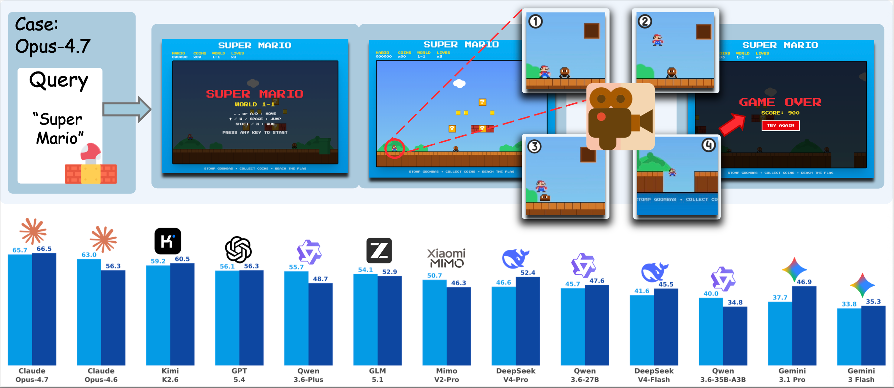

<div align="center">
  <h1>
    
    Cookie-Bench
  </h1>
  <h3>Continuous On-screen Key Interaction Evaluation for Web Generation</h3>

  <p>
    <a href="https://arxiv.org/pdf/2605.30000"></a>
    <a href="https://huggingface.co/datasets/Y36521478Y/Cookie-Bench"></a>
    <a href="https://modelscope.cn/datasets/xiaoyangdemoonlake/Cookie-Bench"></a>
  </p>

  <p>
    Official repository for <b>Cookie-Bench: Continuous On-screen Key Interaction Evaluation for Web Generation</b>.
  </p>
</div>

Cookie-Bench studies how to evaluate modern LLM-generated web applications under realistic interactive use. Instead of relying on reference implementations, rigid checklists, or a single static screenshot, Cookie evaluates web artifacts through a live evidence chain: static perception, autonomous interaction, and holistic scoring.

## News

- **Paper:** [arXiv:2605.30000](https://arxiv.org/pdf/2605.30000)
- **Dataset:** [Hugging Face](https://huggingface.co/datasets/Y36521478Y/Cookie-Bench) and [ModelScope](https://modelscope.cn/datasets/xiaoyangdemoonlake/Cookie-Bench)
- **Code:** evaluation server, interaction pipeline, and benchmark utilities are provided in this repository.

## Overview

Cookie-Bench is an **11-domain, 54-leaf, 1,000-query WebDev benchmark** covering both static presentation pages and interactive web applications. It is designed to probe whether generated web artifacts are not only visually plausible, but also functionally usable under continuous interaction.

Cookie is a reference-free evaluator grounded in metacognitive monitoring. It separates evidence accumulation from final judgment:

1. **Static Perception:** observe the rendered page and form an initial visual and structural impression.
2. **Agent-Driven Interaction:** autonomously explore the application while collecting screenshots, screen recordings, audio, logs, and interaction traces.
3. **Dynamic Scoring:** synthesize all evidence into functionality and aesthetics judgments with structured failure attribution.

<p align="center">
  
</p>

<p align="center"><em>Figure 1. Cookie evaluates generated web applications through deployment, autonomous interaction, multimodal evidence collection, and holistic scoring. The benchmark compares frontier LLMs on Cookie-Bench.</em></p>

## Interactive Demonstration

The following example shows Cookie evaluating an LLM-generated Super Mario web game through continuous on-screen interaction.

<p align="center">
  
</p>

## Benchmark

Cookie-Bench contains 1,000 prompts spanning a broad range of web generation scenarios, including content display, data reporting, marketing pages, tools, dashboards, games, and simulations.

<p align="center">
  
</p>

| Property | Description |
| --- | --- |
| Scale | 1,000 WebDev prompts |
| Taxonomy | 11 domains and 54 leaf categories |
| Task types | Static-presentation and interactive-application tasks |
| Difficulty | Easy, medium, and hard tiers |
| Languages | Multilingual prompts covering English, Chinese, French, Spanish, Japanese, German, Korean, and Portuguese |
| Goal | Evaluate user-perceivable web quality without reference implementations |

The dataset is available from both:

- [Hugging Face: Y36521478Y/Cookie-Bench](https://huggingface.co/datasets/Y36521478Y/Cookie-Bench)
- [ModelScope: xiaoyangdemoonlake/Cookie-Bench](https://modelscope.cn/datasets/xiaoyangdemoonlake/Cookie-Bench)

## Evaluation Pipeline

Cookie evaluates a generated web project in five operational stages.

<p align="center">
  
</p>

| Stage | Description | Output |
| --- | --- | --- |
| Install & Start | Install dependencies, launch the project, and verify that the artifact is reachable. | Running web artifact |
| Static Evaluation | Capture page screenshots, runtime logs, and structural signals. | Initial visual and functional priors |
| Agent-Driven Interaction | Explore the page with autonomous interaction and multimodal evidence capture. | Trajectory, keyframes, screencast, audio, and logs |
| Score Adjustment | Identify critical, major, and minor failures across functionality and aesthetics. | Adjusted dimension-level scores |
| Overall Scoring | Aggregate evidence into final calibrated scores. | Final evaluation result |

Cookie reports two main user-facing quality dimensions:

- **Functionality:** semantic correctness, state management, event handling, and interactive behavior.
- **Aesthetics:** layout, visual hierarchy, typography, motion, composition, and perceptual polish.

## Results

Cookie-Bench evaluates 13 frontier LLMs across direct HTML generation and agent-scaffolded React generation settings. The results reveal substantial remaining headroom in interactive web generation, especially when models must maintain coherent behavior over a live session.

<p align="center">
  
</p>

For detailed experimental settings, human-alignment analysis, and ablations, please refer to the [paper](https://arxiv.org/pdf/2605.30000).

## Installation

### Prerequisites

| Dependency | Recommended version | Notes |
| --- | --- | --- |
| Python | 3.12 | Backend evaluation server |
| Node.js | >= 22.15 | Required for Agent-TARS and React projects |
| pnpm | 9.x | `npm install -g pnpm@9` |
| Playwright Chromium | latest | `playwright install chromium` |
| ffmpeg | any recent version | Screencast and video processing |

### Setup

```bash
git clone https://github.com/Haoyue-Yang/Cookie.git
cd Cookie/verifier
cp .env.example .env
bash setup.sh
```

Fill in the required API keys and model endpoints in `.env` before launching the evaluation server.

## Quick Start

Start the verifier server:

```bash
cd verifier
PORT=8325 WORKERS=10 AUTO_START_AGENT_TARS=True python run_verifier_server.py
```

Evaluate an HTML project:

```bash
curl -X POST http://localhost:8325/verify \
  -H "Content-Type: application/json" \
  -d '{
    "code": {
      "index.html": "<!DOCTYPE html><html>...</html>"
    },
    "query": "Build a Super Mario game",
    "language": "html",
    "agent_type": "interactive_video"
  }'
```

Evaluate a scaffolded React project:

```bash
curl -X POST http://localhost:8325/verify-scaffold \
  -H "Content-Type: application/json" \
  -d '{
    "response": "[tar_url]:https://example.com/project.tar.gz",
    "query": "Build an interactive dashboard with charts and filters",
    "project_id": "scaffold-dashboard",
    "agent_type": "interactive_video"
  }'
```

The scaffold endpoint supports:

- `[tar_url]:<url>` for remote tar archives.
- Raw tool-call or file-block style responses for directly supplied projects.

## Output Format

```json
{
  "project_id": "my-project",
  "evaluations": {
    "installation": {
      "score": 1.0,
      "reason": "Dependencies installed successfully"
    },
    "running": {
      "score": 1.0,
      "reason": "Server is running"
    },
    "aesthetics": {
      "score": 1.5,
      "reason": "..."
    },
    "functional": {
      "score": 1.25,
      "reason": "...",
      "details": {}
    }
  },
  "usage": {
    "prompt_tokens": 0,
    "completion_tokens": 0,
    "total_tokens": 0
  }
}
```

Score ranges:

- Installation: 0 or 1
- Running: 0 or 1
- Aesthetics: 0 to 2
- Functionality: 0 to 2

## Repository Structure

```text
Cookie/
|-- assets/       # Figures, result plots, and demo media
|-- datasets/     # Dataset-related utilities and examples
|-- verifier/     # Cookie evaluation server and interaction pipeline
`-- README.md
```

## Citation

If you find Cookie or Cookie-Bench useful, please cite:

```bibtex
@article{yang2026cookiebench,
  title   = {Cookie-Bench: Continuous On-screen Key Interaction Evaluation for Web Generation},
  author  = {Yang, Haoyue and Shen, Zhangxiao and Ding, Fan and Lou, Hangting and Kou, Yifeng and Yu, Haoqing and Li, Jingyao and Wu, Zhengfan and Bao, Siqi and Liu, Jing and Wu, Hua},
  journal = {arXiv preprint arXiv:2605.30000},
  year    = {2026}
}
```

## Links

- Paper: https://arxiv.org/pdf/2605.30000
- GitHub: https://github.com/Haoyue-Yang/Cookie
- Hugging Face dataset: https://huggingface.co/datasets/Y36521478Y/Cookie-Bench
- ModelScope dataset: https://modelscope.cn/datasets/xiaoyangdemoonlake/Cookie-Bench
