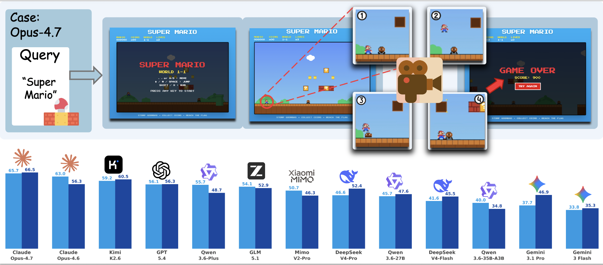
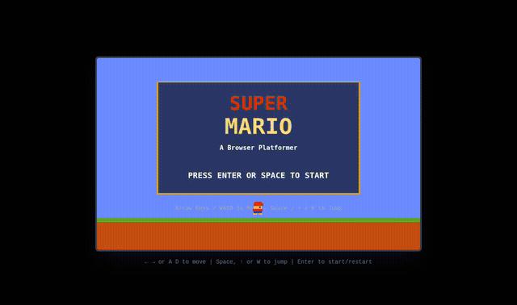
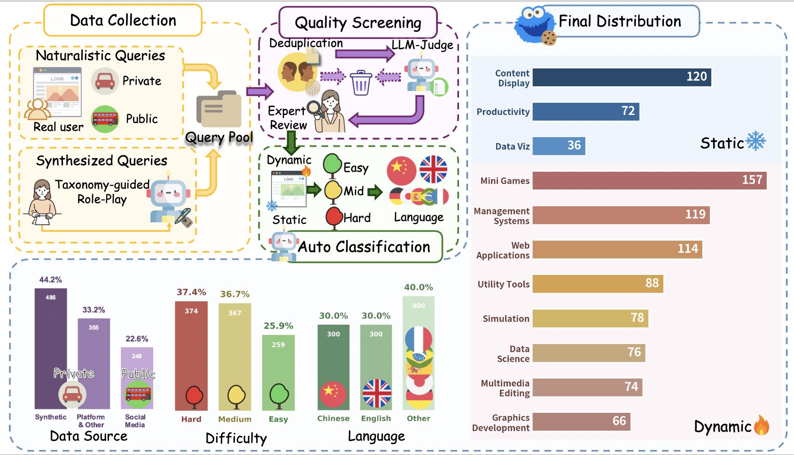
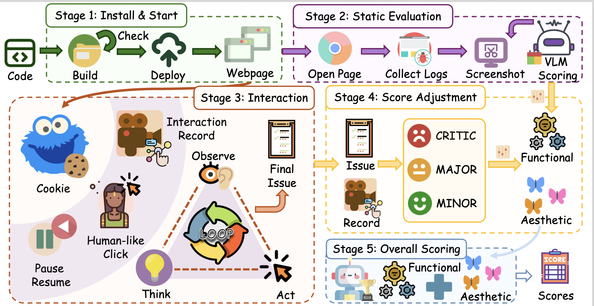
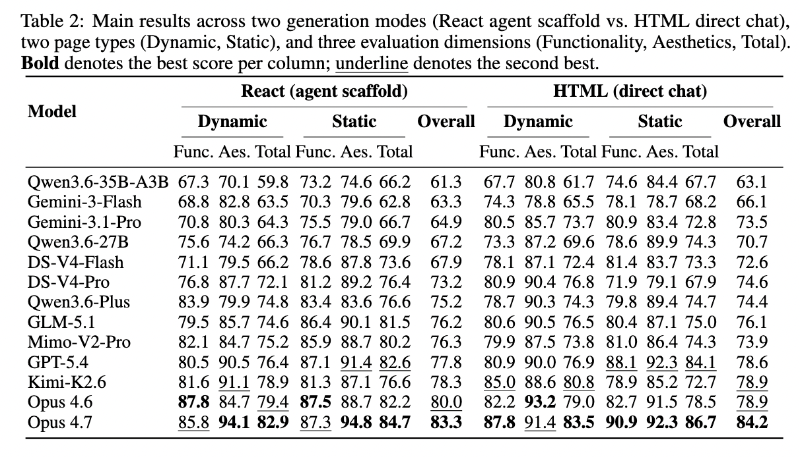

# COOKIE-Bench: Continuous On-screen Key Interaction Evaluation for Web Generation

This repository contains the  implementation of **COOKIE** — a reference-free, autonomously driven, holistically reasoned evaluation system for interactive web generation — and **COOKIE-Bench**, an 11-domain, 54-leaf, 1,000-query benchmark for frontier LLMs.

---

## Overview

**COOKIE** instantiates a new evaluation regime grounded in Flavell's metacognitive monitoring, separating evidence accumulation from judgment across three stages:

1. **Static Perception** — forms a first impression from passive observation
2. **Agent-Driven Interaction** — explores the application autonomously while capturing continuous screen video, audio, and per-step screenshots
3. **Dynamic Scoring** — issues holistic functionality and aesthetics verdicts with structured failure attribution only after the evidence chain is complete


*Figure 1: Top: A "Super Mario" query flowing through deployment, autonomous agent-driven interaction, and multi-modal evidence capture. Bottom: Overall total Win rate for 13 frontier LLMs on COOKIE-Bench.*

### Interactive Video Demonstration


*Demonstration of COOKIE evaluating a "Super Mario" web game generated by a frontier LLM, showing the full agent-driven interaction and evidence capture process.*

### Key Features

- **Reference-free** — No ground-truth implementations or pre-authored checklists
- **Autonomously driven** — Agent plans and executes interaction trajectories on the fly
- **Holistically reasoned** — VLM judges synthesize continuous video, screenshots, and interaction traces into calibrated scores
- **Multi-modal evidence** — Captures screen recordings, audio, per-step screenshots, and interaction logs

---

## COOKIE-Bench Dataset

COOKIE-Bench is an 11-domain, 54-leaf, 1,000-query WebDev benchmark spanning both static-presentation and interactive-application tasks.

### Dataset Construction


*Figure 2: COOKIE-Bench data construction pipeline and dataset statistics. Upper-left: construction pipeline; lower-right: dataset distribution.*


### Dataset Statistics

| Axis | Categories | Distribution |
|------|-----------|-------------|
| **Task Type** | Static / Dynamic | Balanced across presentation and interaction-driven surfaces |
| **Difficulty** | Easy / Medium / Hard | Concentrated on Medium and Hard to probe capability frontiers |
| **Language** | Chinese / English / French / Spanish / Japanese / German / Korean / Portuguese | Rebalanced across 8 languages with stratified retention |

**Taxonomy:** 11 L2 domains covering content display, data reporting, marketing pages, tools, dashboards, games, and simulations.

---

## Methodology

### COOKIE Evaluation Pipeline


*Figure 3: Overview of COOKIE. A five-stage pipeline from code to score: Install & Start, Static Evaluation, Interaction, Score Adjustment, and Overall Scoring.*

| Stage | Description | Output |
|-------|-------------|--------|
| **1. Install & Start** | Deploy generated code, start dev server, health check | Running web artifact |
| **2. Static Evaluation** | Full-page screenshot, runtime logs, structural inventory | VLM-scored provisional priors |
| **3. Agent-Driven Interaction** | COOKIE Agent explores via Observe→Think→Act loop with human-like clicks | Trajectory, keyframes, screencast, audio, problem summary |
| **4. Score Adjustment** | Grade issues at Critical / Major / Minor severity across Functional and Aesthetic dimensions | Adjusted per-dimension scores with structured failure attribution |
| **5. Overall Scoring** | Aggregate into final calibrated scores | Final functionality and aesthetics scores |

### Evaluation Dimensions

- **Functionality** — Semantic correctness of interactive logic, state management, event handling, and cross-component coordination
- **Aesthetics** — Visual composition, transition naturalness, layout, typography, and perceptual quality


## Installation

### Prerequisites

| Dependency | Version | Notes |
|-----------|---------|-------|
| Python | 3.12 (recommended) | |
| Node.js | >= 22.15 | Required for Agent-TARS and React projects |
| pnpm | 9.x | `npm install -g pnpm@9` |
| Playwright Chromium | latest | `playwright install chromium` |
| ffmpeg | any | For screencast video encoding |

### Setup

1. Clone the repository and enter the directory:
```bash
git clone <repo-url>
```

2. Copy `.env.example` to `.env` and fill in your API keys:
```bash
cd verifier
cp .env.example .env
```

3. Run setup:
```bash
bash setup.sh
```

---

## Quick Start

### Start the Server

```bash
PORT=8325 WORKERS=10 AUTO_START_AGENT_TARS=True python run_verifier_server.py
```

Successful startup should show:
```
Starting gunicorn with 10 workers ...
[2026-05-05 17:39:06 +0800] [3318896] [INFO] Listening at: http://0.0.0.0:8325
[worker 3321042] assigned TARS slot 0 → http://127.0.0.1:8890  CDP:9225
...
```

### Submit a Project for Evaluation

**Interactive video evaluation for HTML projects (`/verify` endpoint):**

```bash
curl -X POST http://localhost:8325/verify \
  -H "Content-Type: application/json" \
  -d '{
    "code": {
      "index.html": "<!DOCTYPE html><html>...</html>"
    },
    "query": "Build a Super Mario game",
    "language": "html",
    "agent_type": "interactive_video"
  }'
```

**Interactive video evaluation for React scaffold projects (`/verify-scaffold` endpoint):**

```bash
curl -X POST http://localhost:8325/verify-scaffold \
  -H "Content-Type: application/json" \
  -d '{
    "response": "[tar_url]:https://example.com/project.tar.gz",
    "query": "Build an interactive dashboard with charts and filters",
    "project_id": "scaffold-dashboard",
    "agent_type": "interactive_video"
  }'
```

For react scaffold projects, the `response` field supports two formats:
- `[tar_url]:<url>` — download and extract the tar archive
- Raw tool_call blocks — parsed as file blocks directly

### Response Format

```json
{
  "project_id": "my-project",
  "evaluations": {
    "installation": { "score": 1.0, "reason": "Dependencies installed successfully" },
    "running": { "score": 1.0, "reason": "Server is running" },
    "aesthetics": { "score": 1.5, "reason": "..." },
    "functional": { "score": 1.25, "reason": "...", "details": {} }
  },
  "usage": { "prompt_tokens": 0, "completion_tokens": 0, "total_tokens": 0 }
}
```

Score ranges: installation (0/1), running (0/1), aesthetics (0–2), functional (0–2).

---

## Experimental Results

### Main Results on COOKIE-Bench

We evaluate 13 frontier LLMs on COOKIE-Bench across functionality and aesthetics dimensions.



## Citation

If you find COOKIE or COOKIE-Bench useful, please cite:

```bibtex

```
